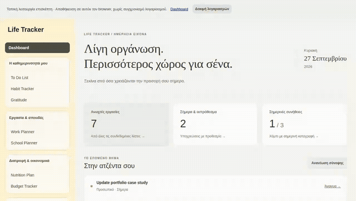
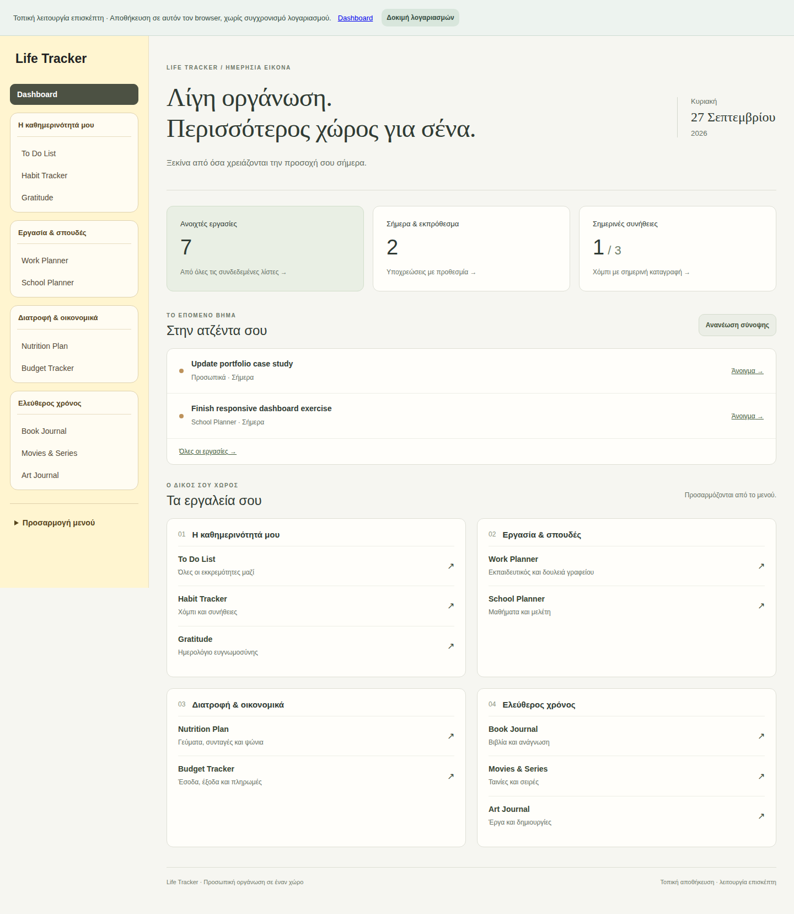
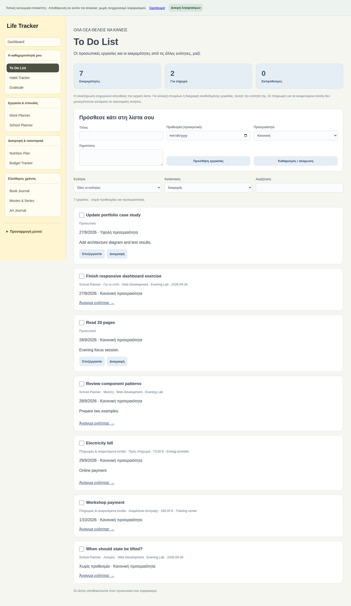
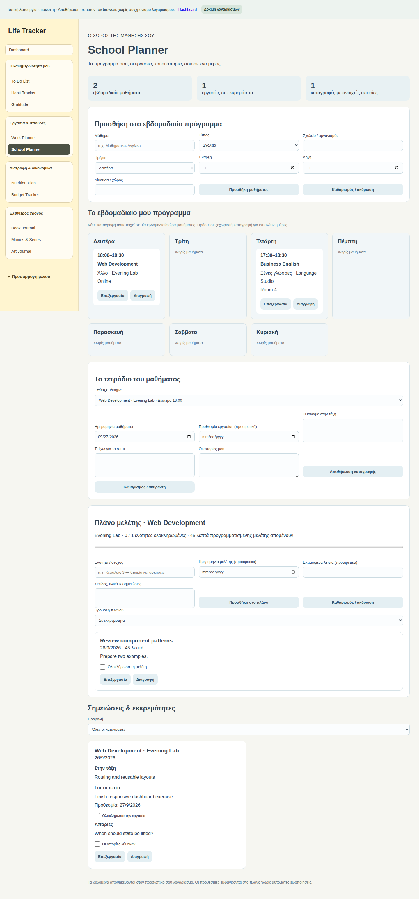
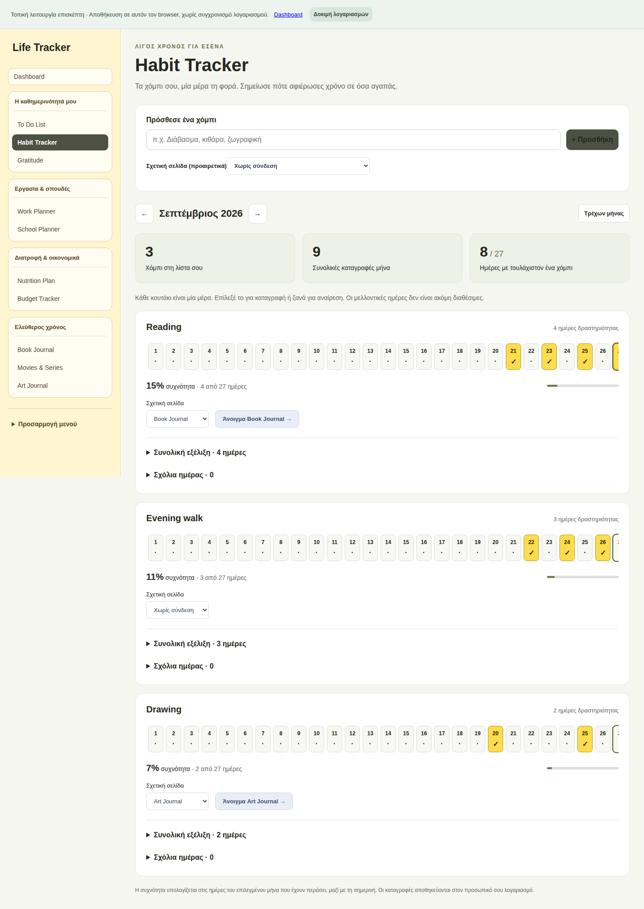
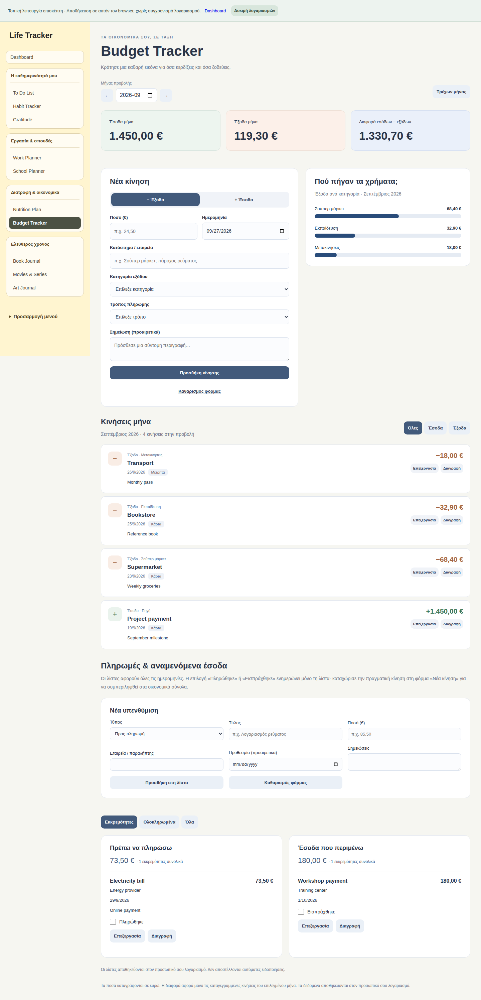
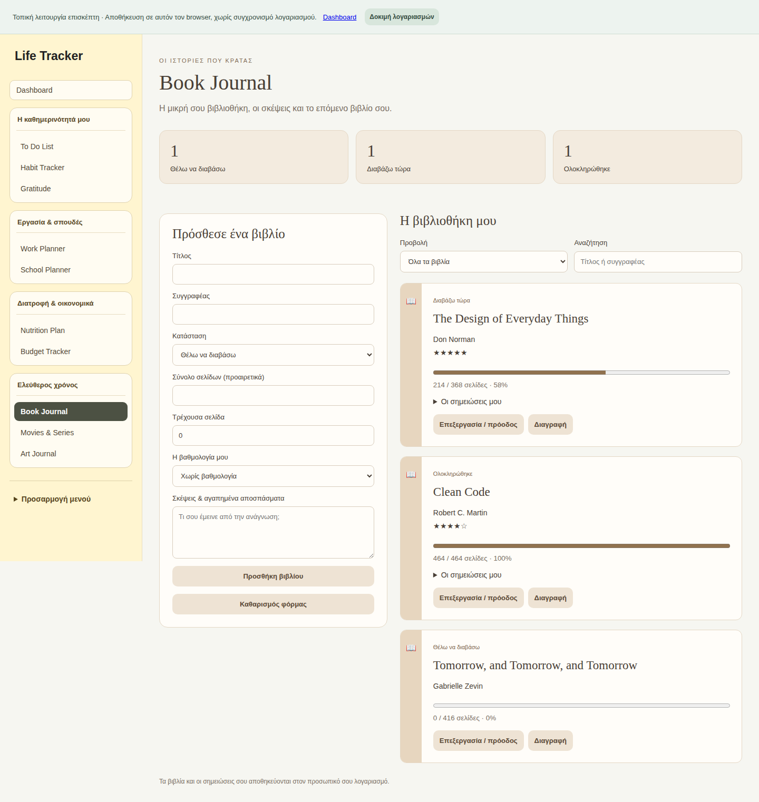
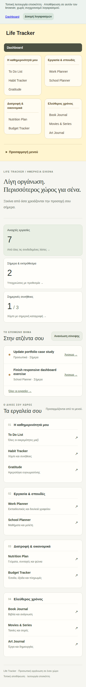
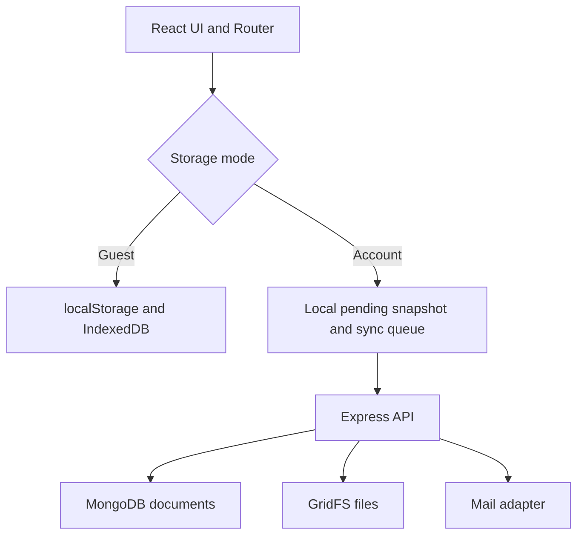

# Life Tracker

A privacy-conscious personal organization application that brings daily planning, learning, wellbeing, finances, and personal journals into one coherent workspace.

> **Source code is private — technical walkthrough available upon request.**

This repository is a public product and engineering showcase. It contains documentation, real application screenshots, and a short demo generated from fictional data. It does **not** contain source code, build artifacts, credentials, or user data.

## Demo

The downloadable video version is available in [`assets/life-tracker-demo.mp4`](assets/life-tracker-demo.mp4).

## Product overview

Life Tracker is designed around a simple idea: everyday information should stay connected without being duplicated. A school assignment, an expected payment, or a work task remains owned by its original module while also appearing in one centralized To Do view.

### Main capabilities

- Daily dashboard with open tasks, deadlines, and habit progress
- Centralized To Do list that aggregates multiple modules
- Habit tracking with monthly activity and optional linked pages
- School planner with timetable, class journal, questions, homework, and study tasks
- Work planning for office and teaching workflows
- Budget history plus planned payments and expected income
- Nutrition, shopping, recipes, and gratitude tools
- Book, film/series, and art journals
- Customizable navigation
- Guest-mode local storage and account-based synchronized storage

## Screenshots

| Dashboard | Centralized To Do |
| --- | --- |
|  |  |

| School Planner | Habit Tracker |
| --- | --- |
|  |  |

| Budget Tracker | Book Journal |
| --- | --- |
|  |  |

### Responsive layout

## Architecture

The UI uses one storage interface, while the selected mode determines whether data stays on the device or is synchronized through the API. This separation keeps page components focused on product behavior instead of transport details.

## Selected technical decisions

### One task, one owner

The centralized To Do list projects work from its source modules instead of copying it. Completing an aggregated item updates the original record, preventing two versions of the same task from drifting apart.

### Local-first interaction with explicit synchronization

Guest data stays in browser storage. Signed-in accounts use a local pending snapshot and a serialized synchronization queue so an interaction can complete immediately while remote persistence follows. Revision checks surface conflicts instead of silently overwriting newer server state.

### Exact money representation

Monetary values are stored as integer cents. Parsing, validation, totals, and formatting are kept separate so decimal floating-point errors do not affect balances.

### Defensive persistence boundaries

Saved data is validated when loaded. Invalid or malformed structures fail closed and show a recoverable error rather than being edited and persisted again.

More detail: [Technical decisions](docs/TECHNICAL_DECISIONS.md).

## Technology

| Layer | Tools |
| --- | --- |
| Frontend | React 19, React Router 7, Vite 8, modular CSS |
| Backend | Node.js, Express 5 |
| Data | MongoDB, Mongoose 9, GridFS, browser localStorage and IndexedDB |
| Authentication | Salted scrypt password hashing, HttpOnly sessions, email verification and one-time password-reset tokens |
| Quality | ESLint, Node test runner, automated production build, Playwright showcase capture |

## Verification snapshot

The reviewed project state completed:

- Frontend production build: **passed**
- Frontend lint: **passed**
- Automated tests: **15 total — 13 passed, 2 skipped**
- Skipped tests: isolated MongoDB/local-persistence integrations that require their dedicated runtime environment

This is a verification snapshot, not a claim of a completed security audit or production certification. See [Testing notes](docs/TESTING.md).

## Privacy and repository policy

- All visible sample content is fictional.
- No credentials, environment files, database exports, or personal records are published.
- No compiled application is included.
- The public repository is intentionally limited to presentation assets and engineering documentation.

## Discussion

I can provide a private technical walkthrough covering component boundaries, storage abstractions, synchronization behavior, validation, and selected implementation details.

**Source code is private — technical walkthrough available upon request.**

